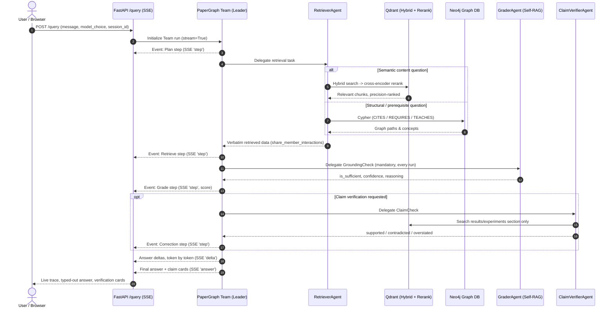

# PaperGraph

**An agentic RAG system that refuses to guess.** Ask it about a paper that isn't in its corpus, and it says so — plainly, once, with nothing tacked on. Ask it to check a claim, and it will tell you when a paper's abstract overreaches beyond what its own results actually show. Every retrieval, grading, and correction step streams live to the UI as it happens, not after the fact.

Built on [Agno](https://github.com/agno-agi/agno): a 5-agent team (Retriever, Grader, Sequencer, Jargon Decoder, Claim Verifier) coordinating over a hybrid Qdrant vector store + Neo4j concept graph, with real-time SSE streaming, multi-provider BYOK, and a RAGAS-scored eval harness.

---

## See it catch something

Ingested paper **DuetRAG** claims a general retrieval improvement in its abstract. Asked to verify that claim against the paper's own results section, the ClaimVerifier agent found:

> **Overstated.** The claim is numerically accurate, but the paper's abstract frames it as a general improvement. The results section evaluates only **one dataset (HotPotQA)** with **one base model (LLaMA2-7B)** — no cross-dataset or cross-model validation is reported.

This isn't a canned demo response — it's a live structured `ClaimCheck` object (`is_supported=True, contradiction_found=False, overstated=True`) produced by an agent that searched the actual results section, compared it against the abstract's framing, and reported a nuance a flat true/false verdict can't express.

Ask about a paper genuinely outside the corpus, and the same discipline shows up as a refusal:

> This paper isn't in my ingested corpus yet, so I can't determine prerequisites from the graph.

No hedging, no "but based on general knowledge…" tacked on afterward. Getting agents to actually stop there — instead of quietly filling the gap with parametric knowledge — turned out to be one of the harder problems in this project. See below.

---

## What actually broke, and what that revealed

Portfolio projects usually hide the debugging. This one doesn't, because the bugs were more interesting than the features:

- **A single missing regex character silently broke all real-time streaming.** The SSE parser searched for the literal substring `\n\n` to detect frame boundaries — but the backend (`sse-starlette`) sends `\r\n\r\n`, which does not contain `\n\n` as a substring at all (`\r,\n,\r,\n` — no two `\n`s are adjacent). Every server response arrived correctly; the UI just never noticed, and sat at "running" forever. Confirmed via DevTools: the raw bytes were there, unparsed.

- **Two different agents can run the same correct query and reach opposite conclusions.** Gemini and Groq's `gpt-oss-120b`, given identical Cypher results confirming a paper existed in the graph, sometimes disagreed on whether it existed — because one model reliably read its own tool output before answering, and the other didn't always. The fix wasn't better Cypher; it was forcing every agent to state what a query returned before concluding anything from it.

- **A team leader can override a correct refusal with a wrong answer.** A sub-agent would honestly report "not in corpus" — and the team leader would still append a paragraph of general knowledge afterward, because "be helpful" outranked "be honest" by default. Fixed with an explicit hard rule: a refusal is the complete answer, full stop, nothing after it.

- **`ragas==0.4.3` doesn't actually import**, due to a currently-open upstream bug (unconditionally importing a `langchain_community` submodule that's already been removed in current `langchain-community` releases). Pinned to `0.3.9` and patched the one broken import locally rather than chase a moving target across three interdependent packages.

- **The evaluation itself was lying about retrieval quality.** Initial context precision scored **0.42** — genuinely weak, and the honest baseline the reranker below was built to fix, not a number massaged away.

---

## Measured, not asserted

Real RAGAS scores from the eval harness (`eval/`), not marketing copy:

| Metric | Before reranking | What it measures |
|---|---|---|
| Faithfulness | 0.872 | Every claim in the answer traceable to retrieved context |
| Answer Relevancy | 0.864 | The answer actually addresses the question asked |
| Context Precision | **0.418** | Retrieved chunks are actually relevant (this was the weak point) |
| Context Recall | 0.597 | Retrieval found everything needed for a correct answer |

Context Precision being the clear laggard is *why* a `BAAI/bge-reranker-v2-m3` cross-encoder pass was added on top of hybrid search — over-fetch candidates, re-score them against the real query with a slower but more accurate model, keep only the genuine top matches. Local, no API key, same philosophy as the embedder.

---

## Architecture



---

## Stack

| Layer | Choice | Why |
|---|---|---|
| Agent framework | [Agno](https://github.com/agno-agi/agno) | Native `Team` delegation, structured outputs, real event streaming |
| Vector store | [Qdrant Cloud](https://qdrant.tech/) | Hybrid dense+sparse search, free tier, self-hostable |
| Embeddings / Reranker | `BAAI/bge-base-en-v1.5` / `BAAI/bge-reranker-v2-m3` | Both fully local — no API key, no per-call cost |
| Knowledge graph | [Neo4j AuraDB](https://neo4j.com/cloud/platform/aura-graph-database/) | `CITES`/`TEACHES`/`REQUIRES` edges, real Cypher traversal |
| Session memory | [Mem0](https://mem0.ai/) | Local instance, zero external dependency |
| LLM providers | Gemini / Groq / OpenRouter (BYOK) | Per-request key, never persisted; free-tier-friendly fallback across providers |
| Backend | FastAPI + `sse-starlette` | True incremental SSE, not batch-then-replay |
| Evaluation | [RAGAS](https://docs.ragas.io) | Faithfulness, relevancy, context precision, context recall |
| Frontend | Hand-built HTML/CSS/JS | No framework, no build step, live reasoning trace UI |

---

## Project layout

```
papergraph/
├── agents.py            # Team definition: Retriever, Grader, Sequencer, JargonDecoder, ClaimVerifier + BYOK
├── server.py             # FastAPI: /query (SSE), /ingest, /graph, /papers, /models
├── event_mapper.py       # Raw Agno events -> UI trace steps + token deltas
├── db.py                 # Neo4j + Qdrant (hybrid + rerank) + workspace isolation
├── etl.py                # arXiv ingestion: section-aware chunking, concept extraction
├── eval/
│   ├── dataset.json       # 15 categorized ground-truth questions (factual/comparison/graph/refusal/claim)
│   ├── run_evals.py       # RAGAS runner — direct Team calls, no server needed
│   └── README.md          # Metric definitions and interpretation guide
├── docs/
│   └── DESIGN_DECISIONS.md # Full architectural rationale and failure-mode log
├── frontend/
│   └── index.html         # Dark-mode UI, collapsed reasoning trace, live graph view
└── .env.example
```

---

## Quickstart

**Prerequisites**: Python 3.11+, [uv](https://github.com/astral-sh/uv), a Neo4j instance (AuraDB free tier works), a Qdrant instance (Cloud free tier works).

```bash
git clone https://github.com/shoraaz/papergraph.git
cd papergraph
uv sync
cp .env.example .env   # fill in NEO4J_*, QDRANT_*, GOOGLE_API_KEY
.venv\Scripts\uvicorn server:app --port 8000 --reload
```

Open `http://localhost:8000`.

### Ingest papers

```bash
.venv\Scripts\python.exe etl.py "retrieval augmented generation" --max-papers 15
.venv\Scripts\python.exe etl.py --ids 2310.11511v1 2401.15884v3   # targeted
```

Visitors can also ingest their own papers live via the UI — isolated to their session, never mixed into the shared corpus.

### Run the eval suite

```bash
.venv\Scripts\python.exe eval/run_evals.py --limit 3              # smoke test
.venv\Scripts\python.exe eval/run_evals.py --output eval/results.json   # full run
.venv\Scripts\python.exe eval/run_evals.py --start-from-id q08    # resume after a rate-limit interruption
```

See [`eval/README.md`](eval/README.md) for metric definitions, and [`docs/DESIGN_DECISIONS.md`](docs/DESIGN_DECISIONS.md) for the full architectural rationale behind every decision above.

---

## License

MIT.
